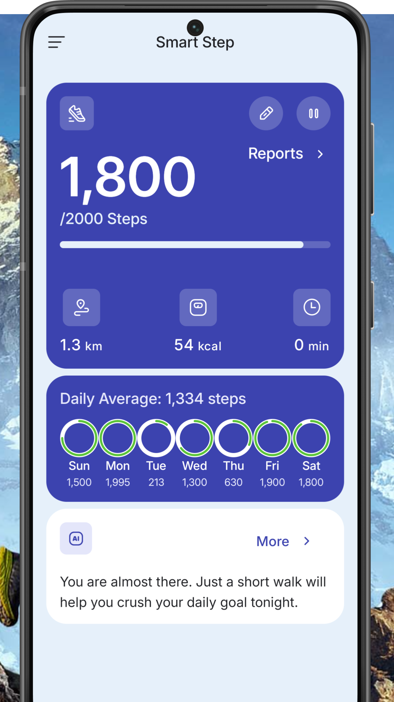
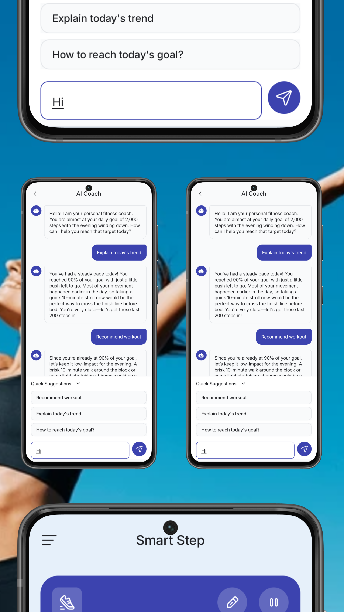
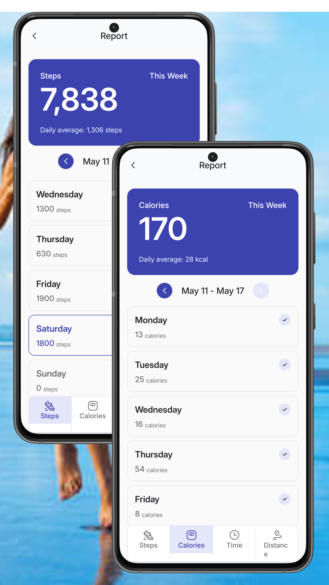

<div align="center">
  <a href="#">
    
  </a>

<h1 align="center">
<b><i>SmartStep</i></b>
</h1>

<p align="center">
  
  
  
</p>

<p align="center">
  A modern Android step-tracking app built with Jetpack Compose, Room, DataStore, Foreground Services, and AI-powered fitness insights.  
  <br />
  <a href="#-screenshots">Screenshots</a> •
  <a href="#-features">Features</a> •
  <a href="#-tech-stack">Tech Stack</a> •
  <a href="#-getting-started">Getting Started</a> •
  <a href="#️-author">Author</a> •
  <a href="#-contributing">Contributing</a>
</p>
</div>

---

## 📱 About SmartStep

**SmartStep** is an Android step-tracking app designed to help users track their step count and review activity trends.

The app uses the device step counter sensor to track steps and then computes distance travelled and calories burnt. It stores daily activity records locally, and provides weekly analytics. SmartStep also includes an AI Coach that gives friendly insights based on the user’s daily progress.

Built with **Kotlin**, **Jetpack Compose**, and modern Android development practices, SmartStep focuses on clean UI, reliable background tracking, and simple fitness motivation.

---

<p align="center">
  <!-- Google Play badge -->
  <a href="#" target="_blank">
    
  </a>
</p>

<p align="center">
  <!-- Demo GIF -->
  
</p>

---

## 📸 Screenshots

<p align="center">
 &nbsp;&nbsp;&nbsp;
 &nbsp;&nbsp;&nbsp;
 
</p>

---

## ✨ Features

- 👣 Real-time step tracking using the device step counter sensor
- 🎯 Step Goal tracking
- 🔥 Calories burned estimation
- 📍 Distance calculation based on user profile
- ⏱ Active time tracking
- 📊 Weekly activity analytics
- 🗓 Daily activity history
- 🧠 AI Coach for personalized fitness insights
- 🔔 Foreground service notification for background tracking
- 💾 Local persistence with Room Database and DataStore
- 🌙 Modern Material 3 UI built with Jetpack Compose

---

## 🚀 Tech Stack

- 🟣 **Kotlin** — primary programming language
- 🎨 **Jetpack Compose** — modern declarative UI toolkit
- 🧩 **Material 3** — clean and adaptive UI components
- 🧱 **MVVM + Clean Architecture** — maintainable app structure
- 💾 **Room Database** — local storage for daily activity metrics
- ⚙️ **DataStore** — user preferences and app settings
- 🔄 **Kotlin Coroutines & Flow** — reactive and asynchronous data handling
- 🧭 **Navigation Compose** — screen navigation
- 🧪 **Koin** — dependency injection
- 🔔 **Foreground Service** — background step tracking
- 📟 **Android Sensors API** — step counter sensor integration
- 🤖 **Gemini AI** — AI-powered fitness coaching insights

---

## 🧰 Getting Started

### Prerequisites
- Android Studio [Panda](https://developer.android.com/studio) or Later 
- Android Device or Emulator running Android 7.0 (Nougat - API 24) or higher  

### Installation
1. Clone the repository:
   ```sh
   git clone https://github.com/Tonnie-Dev/SmartStep


## 🖋️ Author

**Tonnie** – [@Tonnie-Dev](https://github.com/Tonnie-Dev)

<p align="left">
 <a href="https://www.buymeacoffee.com/AgVrgB4N3r" target="_blank">
    
  </a>
  <a href="https://www.linkedin.com/in/antony-muchiri/" target="_blank">
    
  </a>
  <a href="https://twitter.com/Tonnie_Dev" target="_blank">
    
  </a>
</p>


## 🛂 Contributing

Contributions Lazy Pizza are welcome and appreciated! Whether it's a bug fix, new feature, improvement, or even a typo correction – you're more than welcome to jump in 🚀

If you are interested in seeing a particular feature implemented in this app, please open a new issue after which you can make a PR!

### 📜 License

This project is licensed under the [MIT License](./readme-assets/LICENSE).p
